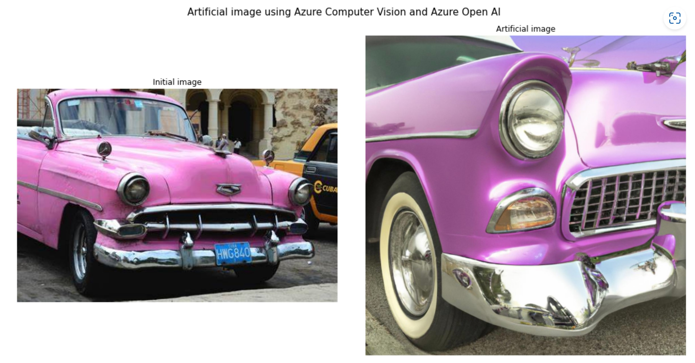
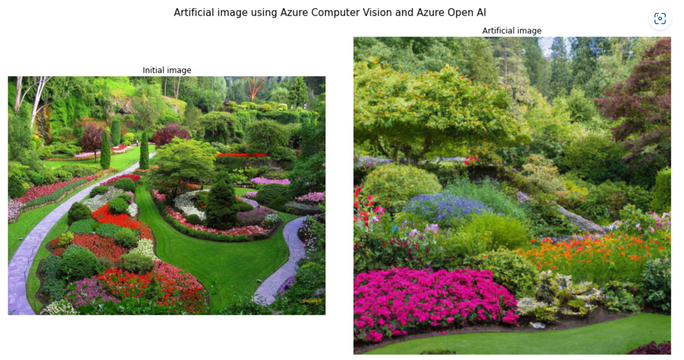
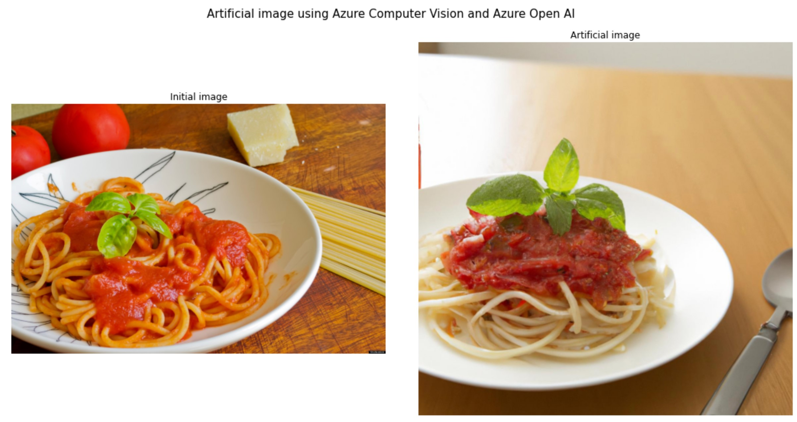

# Image to image with Azure AI

A simple way to do image to image generation using Azure Computer Vision and Azure Open AI

## Process
1. We are using Azure Computer Vision 4 to generate the main caption and all the tags from an existing image
2. Then we are saving all these information as a prompt
3. We can generate the artificial image using this prompt with Azure Open AI and its Dall e 2 integration

## Screenshots

## Documentation
https://learn.microsoft.com/en-us/azure/cognitive-services/computer-vision/overview
https://learn.microsoft.com/en-us/azure/cognitive-services/openai/overview

25-May-2022 Serge Retkowsky | serge.retkowsky@microsoft.com | https://www.linkedin.com/in/serger/
